## 🧠 About Me
* **👩‍🎓Digital Design and Creation - UOC**
* **📍Born in Peru, raised in Spain**
* **Interested in UX/UI and web development**

## 🌱 Soft Skills

* **Curiosity & continuous learning**
* **Creative sensitivity**
* **Adaptability**

## ⚙️ Current Stack

### 🎨 Design

* Figma
* Adobe Suite
* Stitch (AI-assisted ideation)

### 💻 Development (learning)

* HTML
* CSS
* JavaScript
* VS Code

### 🤖 Tools

* ChatGPT (prompting)
* NotebookLM
* Notion

## 🚀 Currently

* 🎓 Fullstack + AI Bootcamp @ Factoria F5 (FEMCODERS P9)
* 🎯 Looking for a hybrid role (UX/UI + Frontend)

## 📫 Contact

## 📊 GitHub Stats

